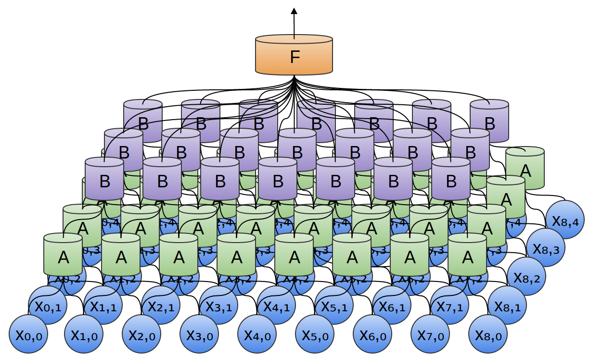
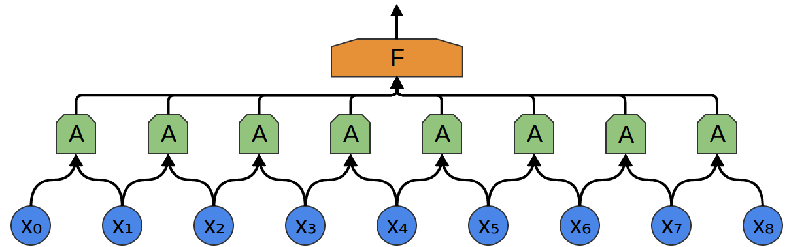
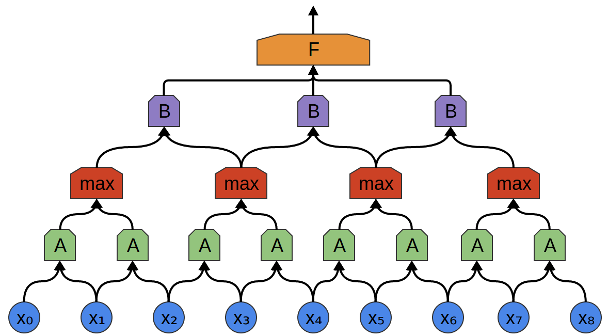
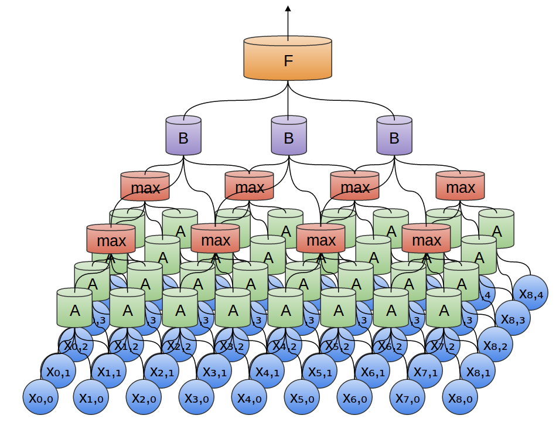
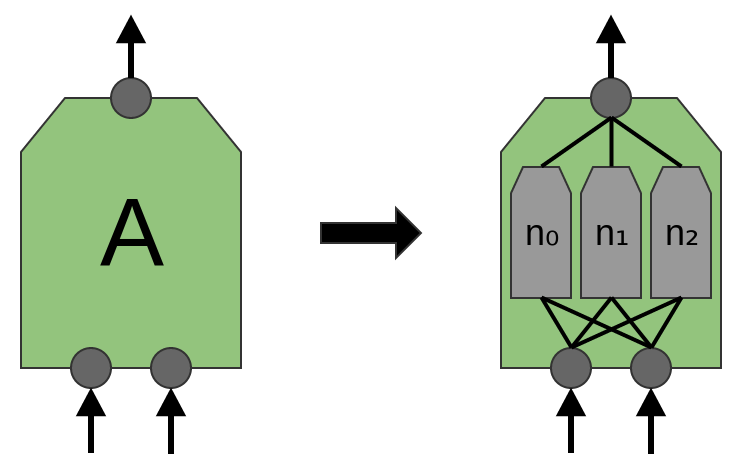
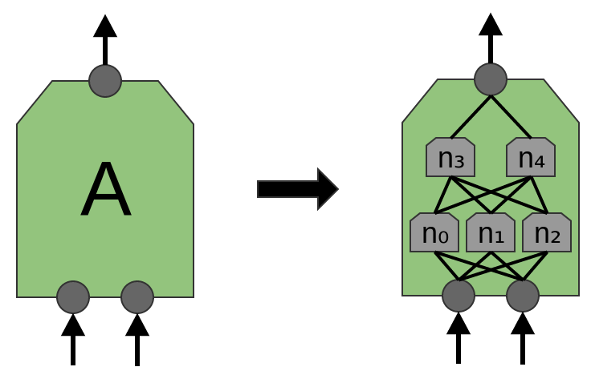
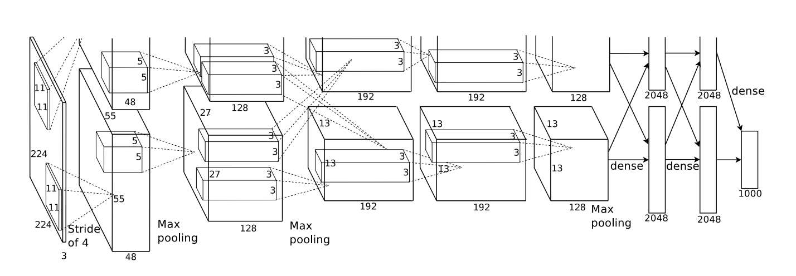
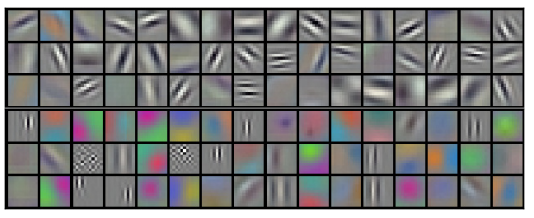
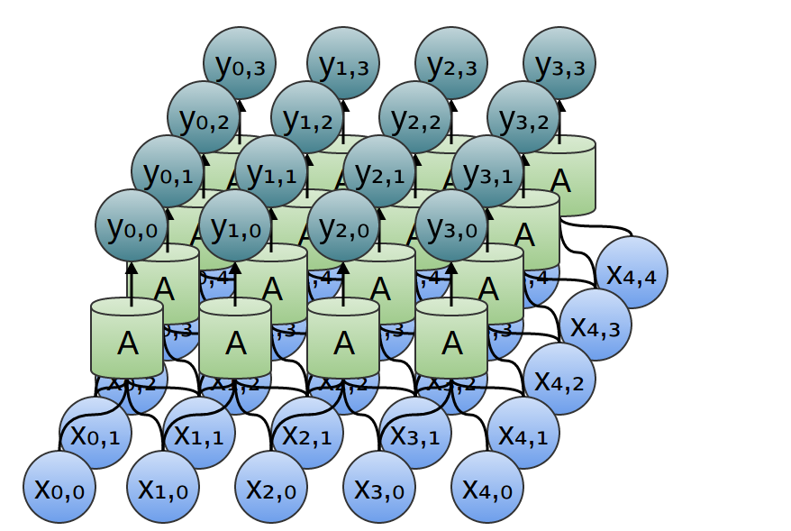

# Introduction
卷积神经网络(CNN)应用于各种模式识别(视觉,语音...).
CNN是一种使用同一个神经元的许多相同副本的神经网络.
> Convolutional neural networks are just one type of neural network that uses the more general trick, **weight-tying**.

这种机制使网络能够拥有大量神经元,同时保持需要学习的参数数量相对较小.
A 2D CNN:

# Structure of CNN
假设我们想把一段音频输入神经网络,让其预测人类是否在说话.
我们在不同时间步获取音频的样本(均匀间隔).
我们想要关注一些他们的局部特征(e.g.在给定时间附近有哪些频率的声音?它们是在增加还是减少?)
所以,我们创建一组神经元A(A是神经元组),用于查看小时间片段:

当然,可以再创建一组神经元B.
但是通常我们在这之间加一个池化层(Pooling).其中最大池化层非常流行.
最大池化层将前一层分为多个小块,然后取每个小块中的最大值作为这一个小块的值(降维).

我们有二维卷积层:这时我们看的是块(2D)而不是段:

其实也有三维卷积网络,主要应用于视频以及体数据(3D医学扫描)等数据.

我们对A进行更深入的理解:
A是一组并行工作的神经元:

一种新的结构:“Mlpconv”层,A将包含多层神经元:

# Results of CNNs
远超当时的图像分类:

第一个卷积层被分在两个GPU上学习:

# Formalizing Convolutional Neural Networks

$$y_{n,m}
= A \begin{pmatrix}
x_{n,m} & x_{n+1,m} & \cdots \\
x_{n,m+1} & x_{n+1,m+1} & \cdots \\
\vdots & \vdots & \ddots
\end{pmatrix}$$
$$A(x)=\sigma(Wx+b)$$
当然,理解CNN最好的数学方法是**卷积**
> I admire the elegance of your method of computation; it must be nice to ride through these fields upon the horse of true mathematics while the like of us have to make our way laboriously on foot.  
— Albert Einstein