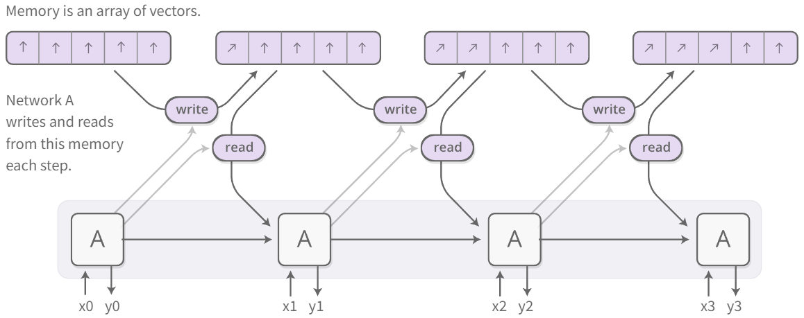
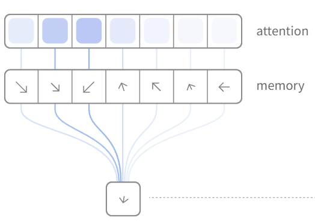
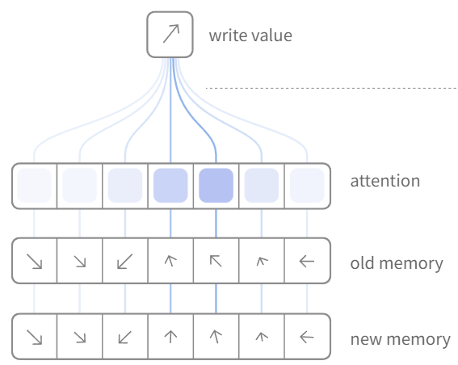
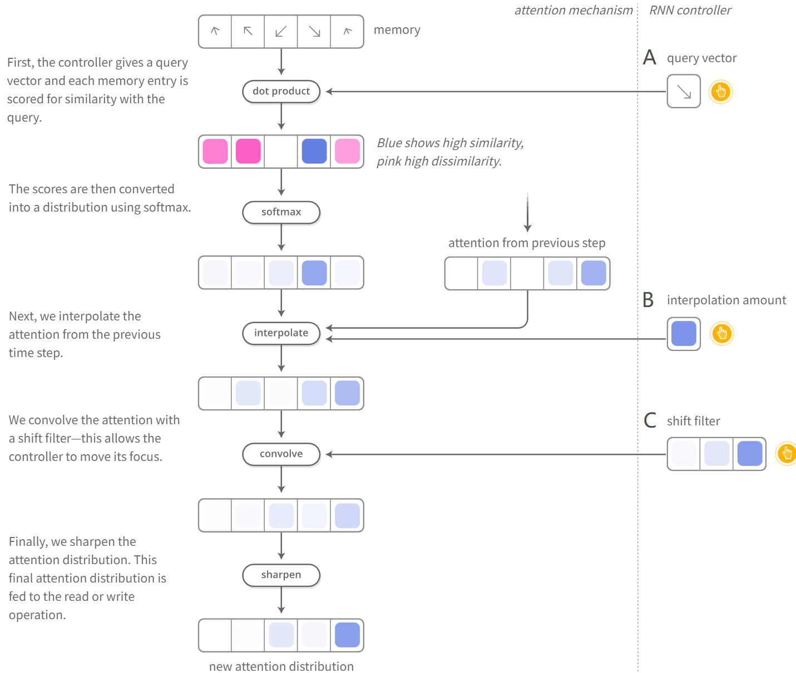
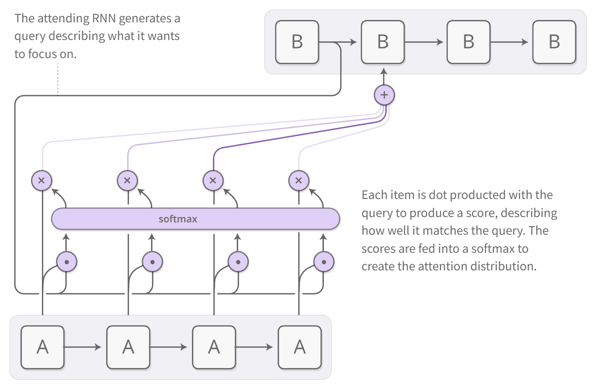
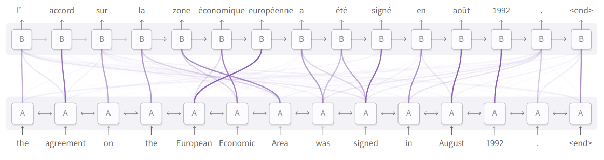
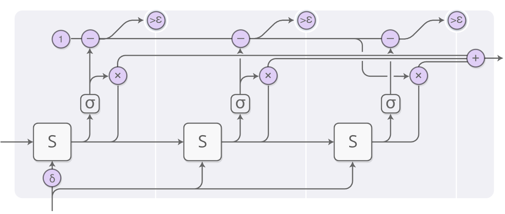
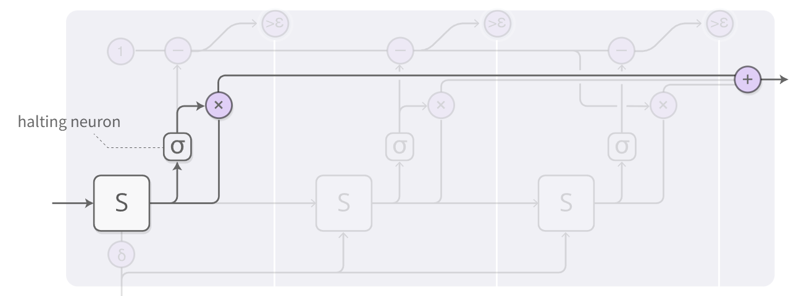
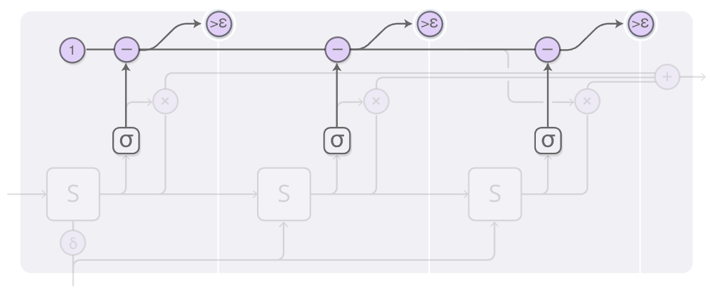
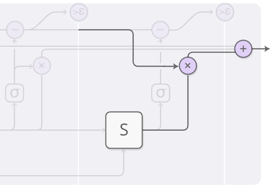

# NTM(Neural Turing Machines)
NTM是由RNN和memory bank组成:

由于我们能用向量表示神经网络的自然语言,所以这里的memory bank就是向量的数组,也即一个矩阵 $$M \in \mathbb{R}^{N × d}$$.
*  𝑁：memory 单元数量
*  𝑑: 向量的维度

我们希望读或者写的位置上存在**梯度**(可以学习).NTMs在每一位置都读&写 **(存在权重)**.
传统的读取方式是:$r=M_i$.
NTMs中为:$r=\sum_iw_iM_i$其中$\sum_iw_i=1,w\in \mathbb{R}^N$.
这样就把离散的位置变成了连续的分布.
对于读取,我们使用"注意力分配":

对于写入,也是同理:

下面讨论一下NTMs是如何分配注意力的:
1. content-based attention:寻找memory中和搜索内容匹配的
2. location-based attention:按移位量相对移动,使得NTM可以循环.

A:
$\vec{x_{query}} \cdot \vec{x_{memory}}$
得到的从小到大对应由粉到蓝

B:
$w_t^{\mathrm{interp}} = g_t\, w_t^{\mathrm{content}} + (1-g_t)\, w_{t-1}.$

C:
$\tilde{w}_t(i) = \sum_{j} w_t^{\mathrm{interp}}(j)\, s_t(i-j).$
实现了一种"滑动"的效果

# Attentional Interfaces
注意力分配给被给予信息的子集的一个部分
> For example, an RNN can attend over the output of another RNN. At every time step, it focuses on different positions in the other RNN.

同样的,我们使用和NTM一样的按权重分配注意力:

B提供的信息和A(memory)合成对每个单元的权重,再把A加权的信息输入到下一个RNN

在翻译文本的时候,注意力RNN可以通过注意力机制,将隐藏变量$h_i$加权存入$c_j$中(区别于传统seq2seq,得到**一个**向量——句子的压缩表示)

比如这里,输出*économique*的RNN(B)就选择注意European和Economic(A).*économique=zone+(European+Economic)*

注意力机制也可以应用于CNN和RNN之间的接口.使得RNN可以查看图像的不同位置:

> More broadly, attentional interfaces can be used whenever one wants to interface with a neural network that has a repeating structure in its output.

注意力接口可以用于任何输出具有重复结构的神经网络进行交互的情况.——**只要输出是逐步生成的,就可以用 attention.**
**Attention 的本质是把“信息访问”从固定连接变成了“可学习的连接”**

# Adaptive Computation Time
标准RNN对每个时间步都执行相同量的计算.Adaptive Computation Time则是每一步进行不同数量的计算.
同样的,一定有一个步数的序列是最优的,所以我们依旧考虑让步数存在梯度
> instead of deciding to run for a discrete number of steps, we have an attention distribution over the number of steps to run.

总览:

1. 主体:

这里有一个停止神经元(halting neuron),是一个sigmoid的神经元,它控制两个(实际上是一个)属性:信息加权以及停止阈值
2. 停止:

当$1-\sum p>\epsilon$的时候停止计算
3. 剩余处理:

在阈值超过$\epsilon$计算停止以后:$$R=1-p_1-p_2$$
输出的就是:$$h=p_1S_1+p_2S_2+RS_2$$

在训练ACT模型的时候,*Cost function*会加上一个计算量的惩罚项