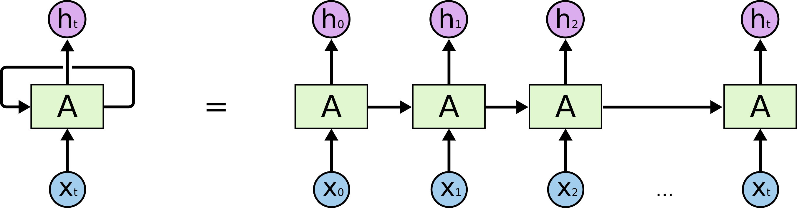
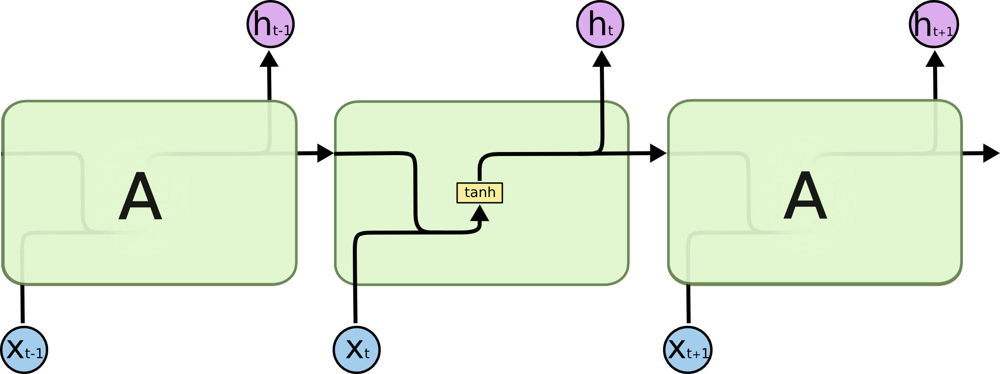
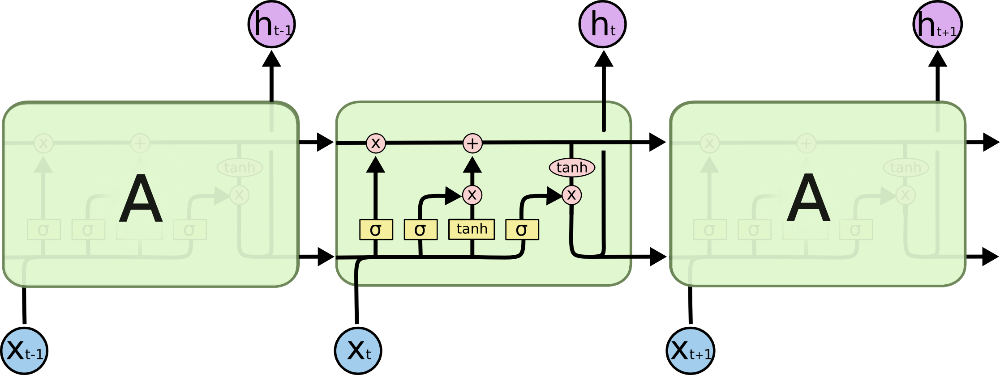
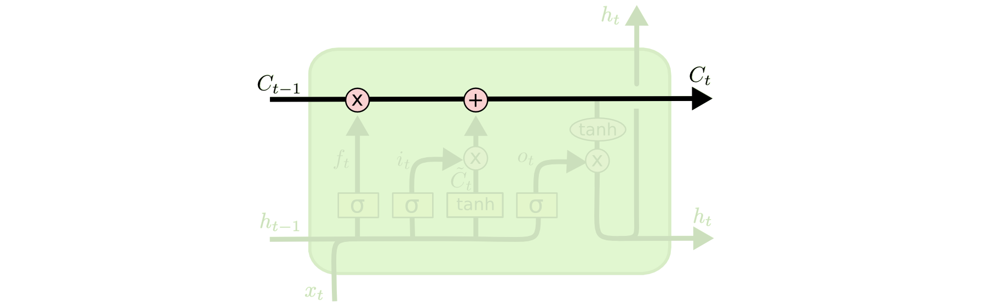
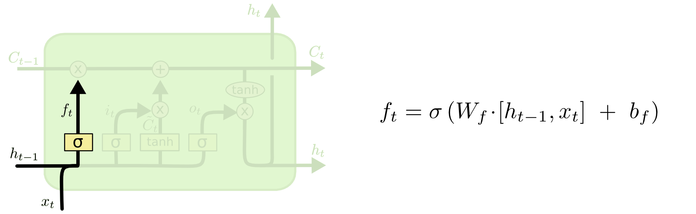
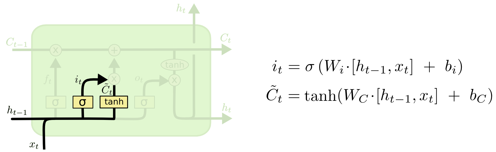
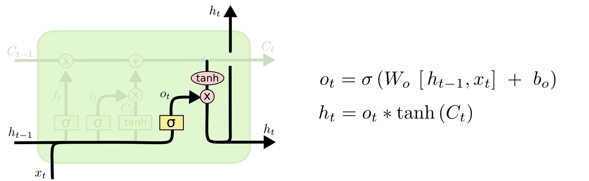
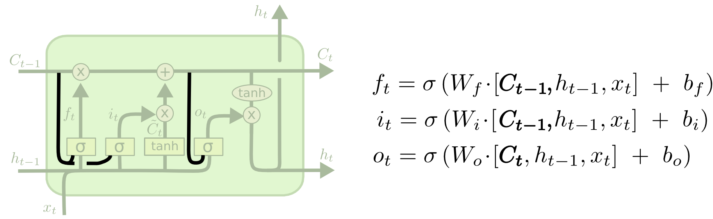
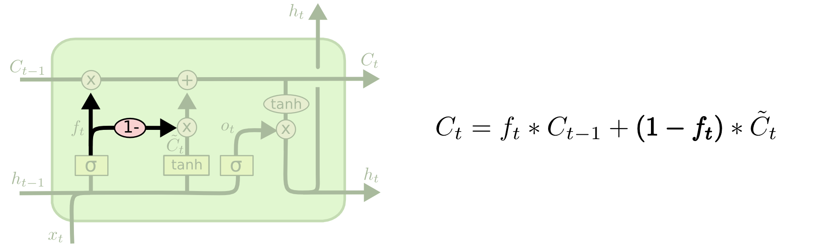
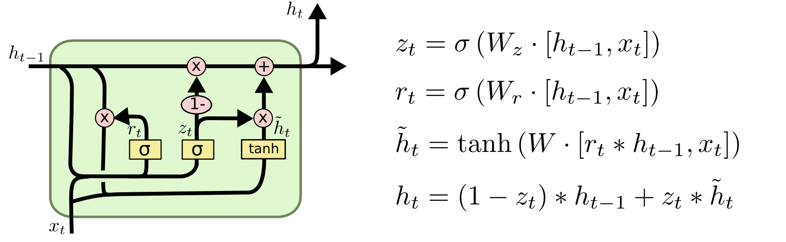

# RNN(Recurrent Neural Networks)

 

RNN是全连接神经网络**链**

> It’s entirely possible for the gap between the relevant information and the point where it is needed to become very large.
>> Unfortunately, as that gap grows, RNNs become unable to learn to connect the information.

RNN可以得到之前的Context,这是全连接神经网络无法做到的.但是随着循环次数增多,RNN就开始难以访问较早的Context.这时我们就需要一些改进:LSTMs

# LSTM(Long Short Term Memory) Network

一般的RNN内部:  

标准的LSTM内部：  

其可以分为几个部分:

1. Cell state: 
 
这一部分也是整个LSTM的主线,$C_{t-1}$在经过下面部分的"信息增减".就得到这个layer的激活值
1. 减少信息:  
我们记信息$A_{t}=[h_{t-1},x_t]$,我们需要通过一个输出层为sigmoid函数神经网络,来决定我们要减少多少$C_{t-1}$
1. 增加信息:  
$A_t$两个去向: 1. 按照RNN的方法产生$\tilde{C_t}$   2.同上,决定加入$\tilde{C_t}$到Cell state的多少
1. 产生$h_t$:  
将最终的$C_t$作为信息源,通过$A_t$的加权.得到$h_t$作为下一层的输出.
# 其他的LSTMs
  