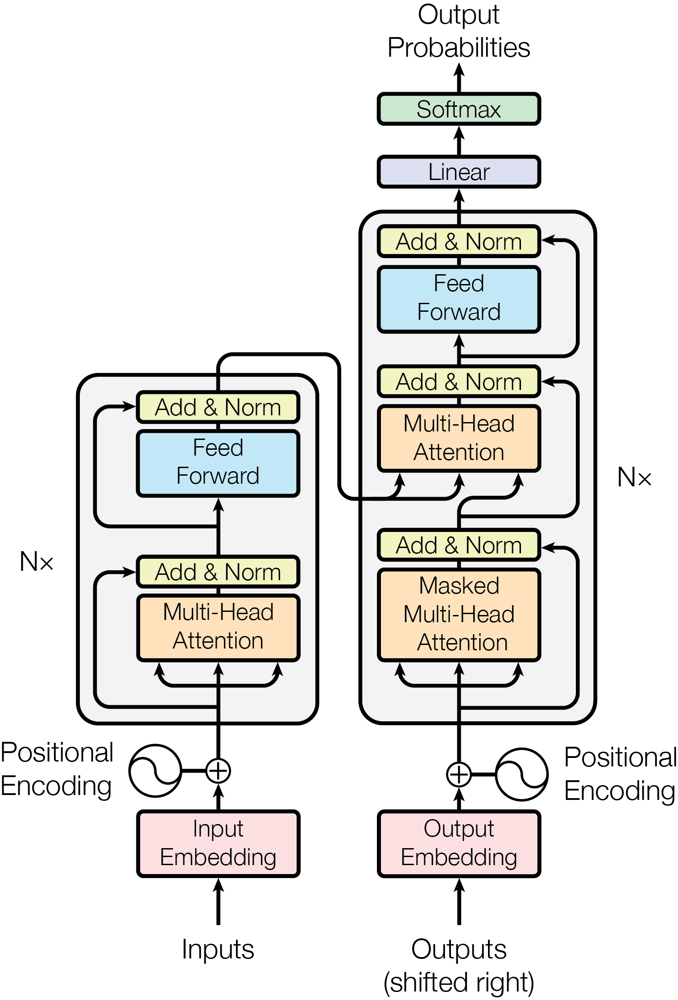
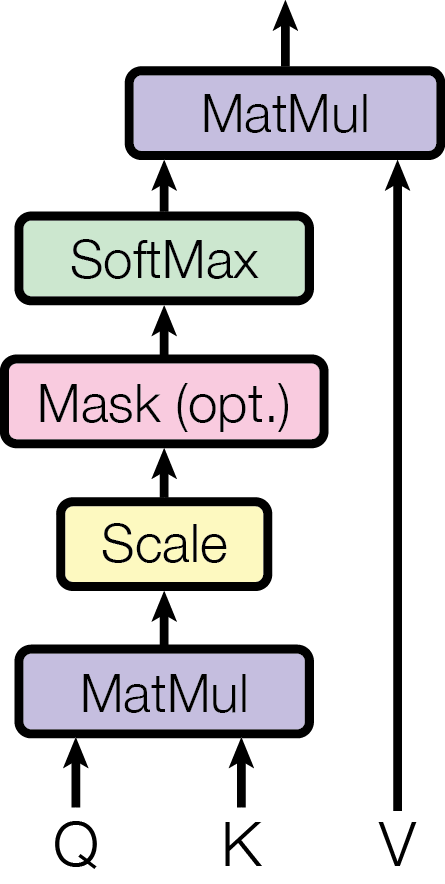
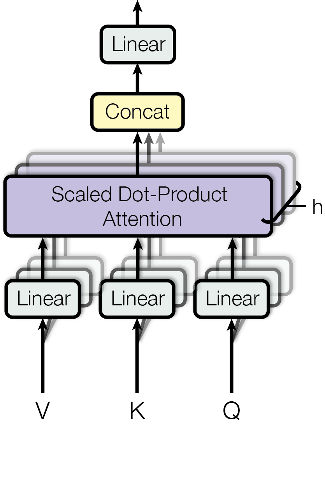
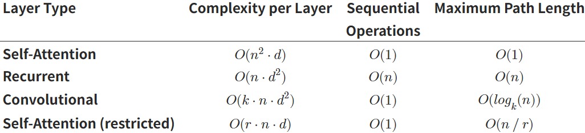

温馨提示:遇到我没当场说明的名词,可以直接跳过,后文大概率会讲

# Abstract

$Transformer$:完全基于注意力机制,摒弃了循环和卷积.其模型在质量上更优越,同时更易于并行化,并且训练时间显著减少.

# Introduction

对于过去的循环模型,尽管有所改进,顺序计算($h_t$由$h_{t-1}$计算得出)的固有约束仍然存在.
注意力机制可以不考虑输入或输出序列中的距离,建立各种状态的依赖关系,然而注意力机制通常与循环网络结合使用

# Background

将两个任意输入或输出位置的信号联系起来的操作数量随着位置之间距离的增长而增加,对于$\mathrm{ConvS2S}$是线性增长,对于$\mathrm{ByteNet}$是对数增长.而$\mathrm{Transformer}$是常数数量操作(虽然会导致有效分辨率降低,但是可以由$\mathrm{Multi-Head Attention}$解决)

自注意力:一种关联单个序列不同位置的注意力机制,以计算序列的表示(序列自己对自己做attention)

# Model Architecture

{:height=70%,width=70%}
Transformer使用堆叠的自注意力机制和逐点全连接层为编码器和解码器(Attention)

## Encoder and Decoder Stacks

### Encoder:

Encoder由六个层(N=6)构成,每个层又有两个子层(第一个是Multi-Head自注意力机制,第二个是一个简单,逐位置的全连接前馈网络).我们再对输出进行残差连接(图中Add)与归一化(Norm)
也就是说,每个子层的输出是$LayerNorm(x+Sublayer(x))$(为了简化,你可以在学习过程中忽略这个)
**同时我们要求模型所有子层以及嵌入层都产生维度为$d_{model}=$ 512的输出**:

```
x∈R^{T × 512}
          ↓
Self-attention → R^{T × 512}
          ↓
       + 残差
          ↓
前馈神经网络 → R^{T × 512}
          ↓
       + 残差
```

### Decoder

Decoder也是由六个层(N=6)组成.除了DecoderLayer中的两个子层以外,其还插入了第三个子层
通过修改decoder的自注意力子层,防止每个位置可以关注未来的位置(输入序列移位以及使用掩码).确保t位置的预测仅来源于小于t位置的**已知**输出

## Attention

*tips:不清楚Q,K,V的先不着急*
一个注意力函是一个由**Q**uery,和一组**K**ey-**V**alue对到一个Output的映射,其中**Q**,**K**,**V**和output都是向量.output是Value的加权求和,其中每个**V**alue分配的权重由**Q**uery和相应的**K**ey的compatibility函数计算得出

### Scaled Dot-Product Attention

{:height=30%,width=30%}
输入是维度为$d_k$的Query和Key,以及维度为$d_v$的Value
计算Query和所有keys的点积,再将其除以$\sqrt{d_k}$,并利用$\mathrm{softmax}$函数得到权重.
实际上,我们同时计算一组query的注意力函数,并将向量组写为一个矩阵$Q$,对key和value同理写为$K$,$V$
$$\mathrm{Attention}(Q,K,V)=\mathrm{softmax}\!\left(\frac{QK^{\top}}{\sqrt{d_k}}\right)V$$
最常用的两种注意力函数是additive attention以及dot-product(multiplicative)action(本文比该算法多了一个缩放因子$\frac{1}{\sqrt{d_k}}$).前者使用一个具有单个隐藏层的FFN来计算compatibility函数.理论上,两个算法复杂度相似,但是实践中点积注意力更快且省空间(源于高度优化的矩阵乘法代码)
对于较小的$d_k$,两种函数相似,但是对于较大的$d_k$,加性注意力由于点积注意力.
这是由于,较大的$d_k$,点积的量级很大,导致softmax进入"平缓"区域,例如:对于均值为0,方差唯一的一列q,k.他们的点积:$q\cdot k=\sum_{i=1}^{d_k} q_i\,k_i$的方差为$d_k$.(这里类似Diffusion Model的操作)

### Multi-Head Attention

{:height=40%,width=40%}
将Q,K,V通过不同的,可学习的线性映射分别投影到$d_k$,$d_k$,$d_v$维上比使用$d_{model}$维的Q,K,V执行一次单一的Attention更有效
注意这里并不是把矩阵拆开(h(head的数量)代表的是$d_{model}$和$d_v$的比值)
关注一下$W^{O}$的维度,就知道Concat是如何堆叠head了
$$\mathrm{MultiHead}(Q,K,V)=\mathrm{Concat}(\mathrm{head}_1,\cdots,\mathrm{head}_h)W^{O}\\ \mathrm{head}_i=\mathrm{Attention}(QW_i^{Q},KW_i^{K},VW_i^{V})$$

其中$W_i^{Q}\in\mathbb{R}^{d_{\mathrm{model}}\times d_k}\quad W_i^{K}\in\mathbb{R}^{d_{\mathrm{model}}\times d_k}\quad W_i^{V}\in\mathbb{R}^{d_{\mathrm{model}}\times d_v}\quad W^{O}\in\mathbb{R}^{hd_v\times d_{\mathrm{model}}}\quad \mathrm{head}_i\in \mathbb{R}^{L\times d_v}$

### Applications of Attention in our Model

Transformer在三种不同的方式中使用了Multi-head注意力:

1. Query来自前一个Decoder层,Key和Value来自Encoder的输出
2. Encoder中含有自注意力层,其中的所有Q,K,V都来自同一个地方(这时是Encoder的前一层输出).
3. 为了防止未来信息泄漏,我们对Scaled dot-product attention进行mask:$A_{ij}=\begin{cases}A_{ij}&j\le i\\-\infty&j>i\end{cases}$
   于是进过softmax函数得到的该权重为0(对未来位置完全不关注)
   
   ## Position-wise Feed-Forward Networks
   
   处理注意力子层以外,每个Encoder和Decoder中的每一层都包含一个FFN,其对每个位置分别且相同地应用.其可表示为:
   $$\mathrm{FFN}(x)=\mathrm{ReLU}(xW_1+b_1)W_2+b_2$$

在同一个序列的不同位置的线性变换相同,但是在不同的Encoder层中并不一样

## Embeddings and Softmax

Embedding矩阵将输入token和输出token转化为$d_{model}$维向量.
我们利用学习到的Embedding矩阵和softmax函数,将Decoder的输出$h_t$转化为下一个token(预测的下一个词)的概率
在Transformer中,在两个Embedding层和pre-softmax线性变换之间共享相同的权重矩阵(Embedding中,将权重乘以$\sqrt{d_{model}}$)

+ 这里需要讲一下:
  预测logits: $z=h_tE^T$, 其中: $z_i=h_tE_i$
  这里logits就是隐状态和该词Embedding点积(也就是他们的相似度).

## Positional Encoding

由于$\mathrm{transformer}$模型完全由注意力实现,而注意力并不包含任何位置信息(绝对or相对): $\mathrm{Attention}(X)=\mathrm{softmax}(QK^T)V$此处是位置无关的.
所以在Encoder和Decoder底部的输入Embedding中添加了 **"Positional Encoding"**,其维度和Embedding相同,两者可以相加(在token相似度的基础上增加了position的相似度->点积可加以及点积代表相似度)
位置编码有多种选择,包括学习和固定的.
在本文中使用不同频率的正弦函数:$$PE_{(pos,2i)}=\sin\!\left(\frac{pos}{10000^{2i/d_{\mathrm{model}}}}\right)$$$$
 PE_{(pos,2i+1)}=\cos\!\left(\frac{pos}{10000^{2i/d_{\mathrm{model}}}}\right)$$
$PE_{pos+k}$可以表示为$PE_{pos}$的线性变换: $PE_{pos+k}=A_kPE_{pos}$
解释一下参数:
1.$\mathrm{pos}$
`["I", "love", "transformers"]`

```
pos(I) = 0
pos(love) = 1
pos(transformers) = 2
```

2.$\mathrm{i}$
$PE(pos,2i)$其实类似二维数组一样($PE$是矩阵)

```
d_model=6:
          i=0         i=1         i=2
       dim0 dim1 | dim2 dim3 | dim4 dim5
pos=0
pos=1
pos=2
```

# Why Self-Attention

1. 每层的总计算复杂度
2. 可并行化的计算量
3. 网络中长期依赖关系之间的路径长度

和RNN,CNN等对比:

$n$是序列长度,$d$是维度,$k$是卷积核大小,$r$是restricted self-attention的邻域大小
restricted指的是:仅考虑输入序列中围绕输出位置大小为$r$的邻域
简述一下表格:

1. **Self-attention:**
   attention要计算$QK^T$ -> $O(n^2d)$
   attention同时可以计算所有token -> $O(1)$
   attention一步通信序列所有位置 -> $O(1)$
2. **RNN:**
   RNN每一步$Wh_{t-1}$,一共$d$步 -> $O(nd^2)$
   顺序计算 -> $O(n)$
   原因同上 -> $O(n)$
3. **CNN:**
   卷积核大小取k,找k个d维向量拼接(数学上等价),等于是长为kd的向量乘以一个kd×d的矩阵 -> $O(knd^2)$
   卷积网络的结构(并行) -> $O(1)$
   卷积是局部连接,需要多层逐步传播 -> $O(\log_k(n))$

不仅单个注意力头可以清晰地学习执行不同的任务,许多注意力头似乎还表现出与句子句法和语义结构相关的行为(不同 attention head 学不同功能)
现在更准确的说法是:

> attention 提供了一种可视化线索,但不等价于解释模型决策

# Conclusion

 $\mathrm{Transformer}$是一种完全基于注意力的序列转导模型,用多头自注意力机制取代了Encoder-Decoder架构中最常用的循环层

# 知识链接:

## 1.Residual connection(残差连接)

核心:$$output=x+Sublayer(x)$$
换一个写法:$$Sublayer(x)=output-x$$
这保证了:梯度不会消失,反向传播时每层都会得到参数的更新(e.g.如果梯度指数下降,前面的几层参数几乎得不到更新)

## 2.Offset by one position

由于模型学习的是$P(y_t\mid y_{i<t})$,显然你不能让模型得到$y_t$,否则他就会"作弊"
RNN中由于顺序计算,永远可以保证输入$y_{t-1}$进行$y_t$预测.
但是Transformer是并行计算,必须通过人为设定来保证,所以我们需要Masked以及Offset by one position并用

## 3.Embeddings(多维)

Embedding 是一个参数矩阵，用于将离散 token 映射到连续向量空间。  
每个 token 对应一个**向量表示**，该向量在高维空间中的几何关系（如距离和方向）编码了语义信息。  
语义不是由单个维度表示，而是由整个向量的分布式表示决定。

## 4.一些卷积

**卷积核:** 一个小的权重矩阵,用来在图像或特征图上"滑动",提取局部特征
**通道混合:** 拿图片举例:
我们先看一个像素,$x=[R, G, B]$
一个卷积就在这个位置计算,一个卷积核:$y=w_RR+w_GG+w_BB$也即$y=w^Tx,其中w\in\mathbb{R}^3$.
拓展到多卷积核:$y=Wx,其中W\in\mathbb{R}^{64×3}$
为什么叫**通道混合**呢?我们输入$[R, G, B]$得到的是边缘特征,纹理特征,颜色差异,亮度变化,方向梯度...

### Separable convolution

普通卷积同时进行空间卷积核通道融合:其层复杂度为$k^2C_{in}C_{out}$(逐元素乘+求和:$k^2C_{in}$,$C_{out}$个卷积核)
而Separable convolution: 先提取特征$k^2C_{in}$再通道融合:$C_{in}C_{out}$

### dilated convolution

在卷积核里“插空”，跳着采样输入(在不改变参数量的情况下,提高覆盖范围)

```
■ ■ ■
■ ■ ■
■ ■ ■
```

```
■   ■   ■

■   ■   ■

■   ■   ■
```

$\mathrm{receptive field}=k+(k-1)(r-1)$
$r = dilation rate(扩张率)$