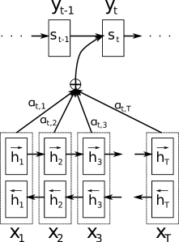

# Abstract
$Attention之滥觞:$
> we conjecture that the use of a **fixed-length vector** is a *bottleneck* in improving the performance of this basic encoder–decoder architecture, and propose to extend this by allowing a model to **automatically (soft-)search** for parts of a source sentence that are **relevant to** predicting a target word, without having to form these parts as a hard segment explicitly.
# Introduction
由于神经网络需要将源句子的所有必要信息压缩成一个固定长度的向量,可能使神经网络难以处理长句子.
确实,基本encoder-decoder的性能会随着输入句子长度的增加而迅速下降

本文引入一种编码器-解码器模型的扩展:
- 该模型每次在翻译中生成一个词时,它(**软**)搜索源句子中集中最相关信息的若干位置,然后根据与*这些源位置以及所有先前生成的目标词*相关的上下文向量来预测目标词.
- 它将输入句子编码成一系列向量，并在解码翻译时自适应地选择这些向量中的一个子集
# Background: Neural Machine Translation
从概率角度看,$\argmax_𝐲⁡p​(𝐲∣𝐱)$就是翻译的目标.一些论文就是使用神经网络学习这种条件分布
## RNN Encoder–Decoder
1. encoder:一个RNN,使得:
$$h_t = f(x_t, h_{t-1})\\c = q\!\left(\{h_1,\cdots,h_{T_x}\}\right)\\其中 
h_t∈ℝ^n是时间t的隐藏状态\\
f和q是一些非线性函数(甚至是LSTM)
$$
2. decoder:
利用之前预测的所有单词和encode出来的上下文向量预测下一个单词:
$$p(\mathbf{y}) = \prod_{t=1}^{T} p\!\left(y_t \mid \{y_1,\cdots,y_{t-1}\},\, c\right)$$
每个条件概率都被建模为:
$$p\!\left(y_t \mid \{y_1\cdots y_{t-1}\}\ c\right)=g\!\left(y_{t-1}\ s_t\ c\right)\\其中 
g是一个非线性、可能包含多层结构的函数\\ 
s_t是 RNN 的隐藏状态$$
# Learning to Align and Translate
本节提出了一个新架构:
该架构由一个双向 RNN 作为编码器和一个在解码翻译时模拟搜索源句的解码器组成
## Decoder: General Description
图解(看不懂没关系):

我们定义这里的条件概率为:
$$p\!\left(y_i \mid y_1,\ldots,y_{i-1},\mathbf{x}\right)=g\!\left(y_{i-1},s_i,c_i\right)\\其中,s_i = f(s_{i-1}, y_{i-1}, c_i).$$

相比于上面的decoder,我们发现传入的参数变为了$c_i$(每个时间步的上下文)
通过输出层为$softmax$的神经网络获得权重$\alpha_{ij}$:
$$c_i = \sum_{j=1}^{T_x} \alpha_{ij} h_j.$$
> By letting the decoder have an attention mechanism, we relieve the encoder from the burden of having to encode all information in the source sentence into a fixed-length vector.
>>tips:$h_i$被称为annotations

所以,Attention 将“信息表示$h_i$”与“信息选择$α_i$”解耦
## Encoder: **Bidirectional** RNN for Annotating Sequences
常规的RNN从$x_1$顺序读取到$x_{T_x}$,但是本文的encoder使用**双向**RNN(BiRNN),每一个词的$h_i$既总结前面的词,**也总结后面的词**
其有两个RNN组成:
1. 前向RNN,顺序读取,得到:$(\overrightarrow{h}_1,\cdots,\overrightarrow{h}_{T_x})$
2. 后向RNN,逆序读取,得到:$(\overleftarrow{h}_1,\cdots,\overleftarrow{h}_{T_x})$

整合得到:$h_j=\bigl[\overrightarrow{h}_j^{\top};\overleftarrow{h}_j^{\top}\bigr]^{\top}$
由于RNN具有更好地表示最近输入的倾向,标注$h_j$将专注于$x_j$周围的单词
