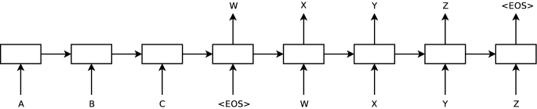

本文作者例子均为"I love you."
# Introduction
DNNs强大之处在于它们可以在适度的步骤内执行任意并行计算.
此外,只要标记训练集包含足够信息来确定神经网络的参数,大型DNN就可以通过监督反向传播进行训练.
> 如果人脑能快速完成任务，说明存在某种可计算函数可以完成该任务

也就是说,**如果问题存在可学习的函数表示，那么足够大的神经网络 + 反向传播通常能找到它**(The Bitter Lesson)

但是DNN的存在很大的局限是:它们只能应用于输入和目标可以合理地用**固定维度**的向量编码的问题,然而许多重要的问题最好用**可变长度**的问题序列来表达.
所以,我们需要一个能学习*Seq2Seq*的映射的方法

先使用一个 LSTM 逐时间步读取输入序列,得到一个大型的固定维度的向量表示,然后再使用另一个 LSTM 从该向量中提取输出序列(其本质上是一个RNN语言模型)
这里 LSTM 的长时间记忆能力非常重要

其中, LSTM 以 **相反的顺序(simple but useful)** 读取输入句子,因为这样做引入了许多短期依赖关系,使优化问题变得更容易.(如果以自然顺序就会是:I→love→you,而对应的法语:"Je t’aime"中与I对应的Je就不与I最近了)

LSTM 的一个有用特性是它能够学习将长度可变输入句子映射到固定维度的向量表示(伏笔)
# The model
RNN 可以很容易地将序列映射到序列,只要输入和输出之间的对齐关系是预先已知的(对于输入和输出序列长度不同且具有复杂和非单调关系的问题,RNN难以应用)

$$p(y_1,\ldots,y_{T'} \mid x_1,\ldots,x_T)
= \prod_{t=1}^{T'} p\left(y_t \mid v, y_1,\ldots,y_{t-1}\right)\\
其中v表示x_1,...,x_T的初始隐藏状态$$

其中,每个 $p\left(y_t \mid v, y_1,\ldots,y_{t-1}\right)$ 分布都使用词汇表中所有单词的 softmax 来表示.换句话说,这个看似是概率的东西实际上是一个**向量**(大小为词表的长度),每个这个位置是词表中"每个单词"的概率.

# 知识链接:
## RNN语言模型:
RNN-lm就是在根据前面的词预测下一个词是什么:
$$P(y_{1:T}) = \prod_{t=1}^{T} P\!\left(y_t \mid y_{<t}\right)$$
训练的目标:
$$\mathcal{L} = -\sum_{t=1}^{T} \log P\!\left(y_t \mid y_{<t}\right).
$$
e.g.已知:"I love you",让$P("you"\mid "I love")$最大
文中:
>The second LSTM is essentially a recurrent neural network language model [28, 23, 30] except that it is conditioned on the input sequence.

的意思就是所有的概率都加了一个序列条件$x$**(输入句子提供的条件信息)**
