# Transformer的特点
## 无先验假设
### CNN: 
1. 卷积核看局部区域,这也就意味着模型假设图像的重要信息来源于局部邻域
2. **同一个**卷积核滑动,模型假设了同一种特征在不同位置等价
### RNN:
1. 当前信息来源于之前时间的信息,意味着模型假设序列是按时间逐步生成的
2. 信息是一步步传播的,模型假设信息是顺序传播的
## 核心计算在自注意力机制
许多工作是取降低复杂度,降低就得注入先验假设(注意力不是每个位置都算)
我们需要根据不同的任务,去注入一些任务相关的先验假设,然后根据一些先验假设去优化
# 概览全局
## Encoder
### *Self-attention layer:*
在Encoder编码某个单词的时候,查看输入句子中的其他单词.
其输出被输入到一个FFN中,被**独立**地应用到序列的**每一个**位置
## Decoder
### *Cross-attention:*
在Decoder生成一个词的时候,关注输入句子中**最相关的部分**.
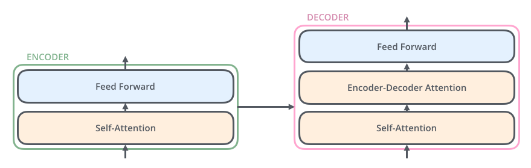
# Tensors In the Picture
首先使用Embedding算法将每个输入词转换为向量(在底部的Encoder中发生,其他的Encoder则接受上一个层的输出)
每个单词并行地流经Encoder的两个层
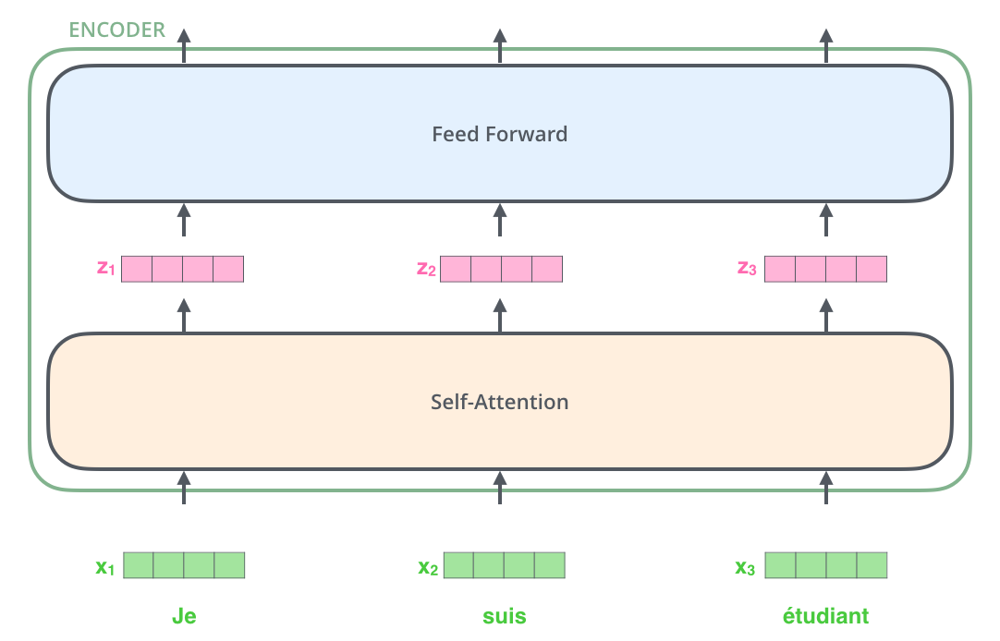
Transformer的一个关键特性:每个位置的词在Encoder中通过自己的路径流动.在Self-attention layer中路径有依赖关系.而FFN中没有这种依赖关系,故各路径可以在通过FFN时并行执行
# Encoding
每个Encoder Layer接受上一个Encoder Layer的输出作为输入
# 自注意力
## 概览
`The animal didn't cross the street because it was too tired`
人类很容易知道it代指的是animal.对于模型,其通过自注意力把it和animal**关联起来**
当**模型处理**每个单词的时候,自注意力机制使得其能够查看输入序列的**其他位置**
**注意力机制是 Transformer 用来将其他相关单词的"理解"嵌入到当前正在处理的单词中的方法**
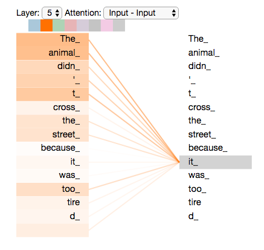
## 细节
**本节的输入序列是:`['Thinking','Machines']`**
1. 对于每个单词,创建一个Query,Key,Value向量.其来源于Embedding乘以一个权重矩阵:
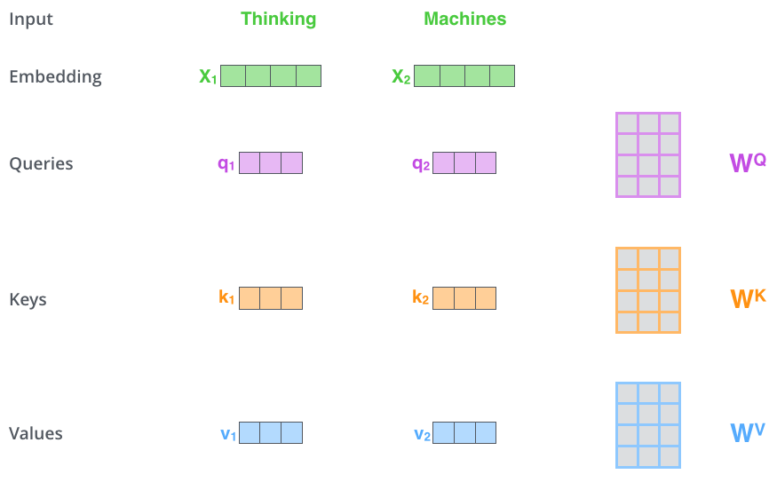
例如将$x_1$乘以$W^Q$产生$q_1$(即Query向量)
2. 我们要计算一个词的Score(决定了我们在某个位置编码一个词时,应该将多少注意力放在输入句子的其他部分),这需要将输入句子的每个词与这个词进行评分
Score由Query和Key向量点积得出,例如计算Thinking的Score:用$q_1$分别点乘$k_1$和$k_2$得到两个Score
3. 将分数除以$\sqrt{d_k}$(稳定化梯度),最后将Score向量输入到$\mathrm{softmax}$中得到注意力的权重
4. 将每个词的Value向量乘以$\mathrm{softmax}$的加权求和

*注意:方框内的是一个Self-attention*
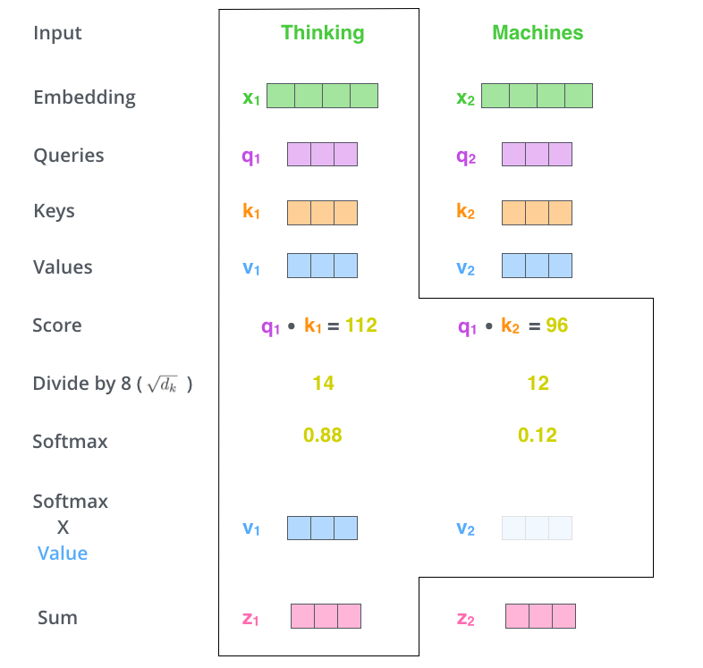
# 自注意的矩阵计算
Q,K,V:
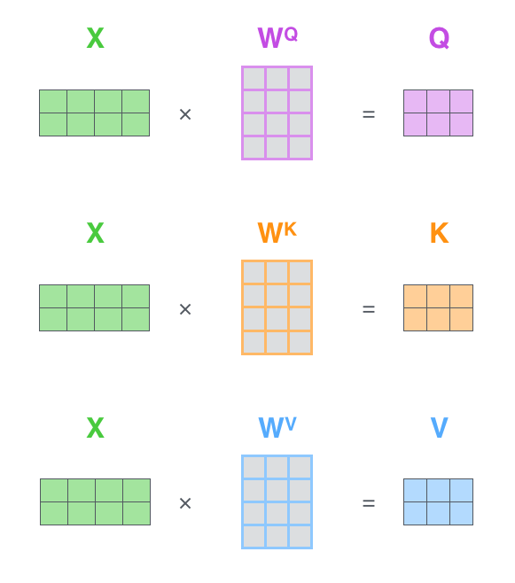
# 多头机制
1. 扩展了模型关注不同位置的能力
2. 注意力层提供多个"Representation子空间",我们有多个Query/Key/Value权重矩阵集
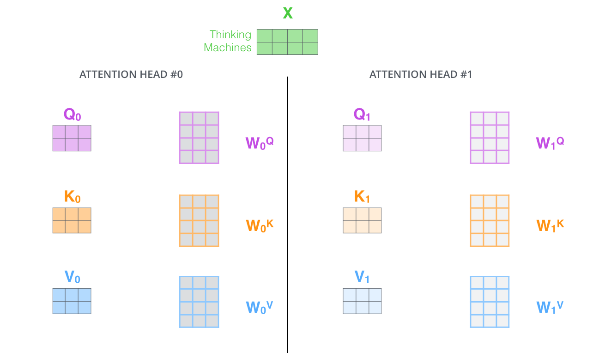
每个注意力头维护独立的$Q$/ $K$/ $V$权重矩阵

3. 我们能得到多个(一般是8个)不同的$Z$矩阵(一个HEAD对应一个)
4. 然后我们将矩阵拼起来$[Z_0,Z_1,...,Z_7]=Z$再乘以一个权重矩阵$W^O$: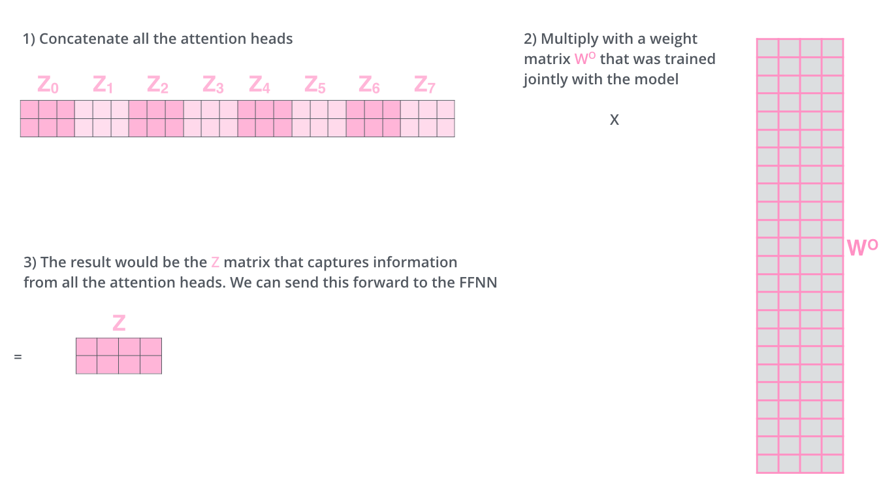

**总览:**
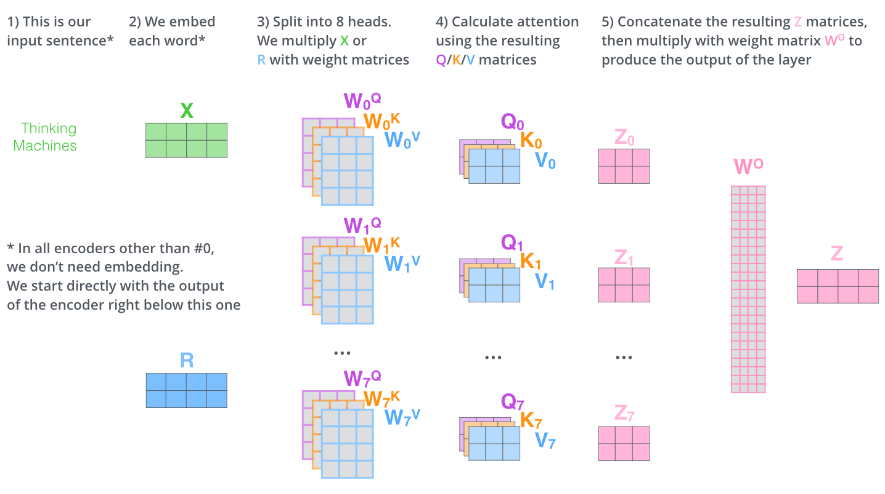
所以我们可以看出来(实际上很难),每个注意力头注意的时什么: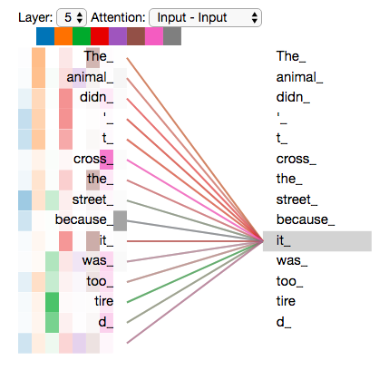
# 位置编码
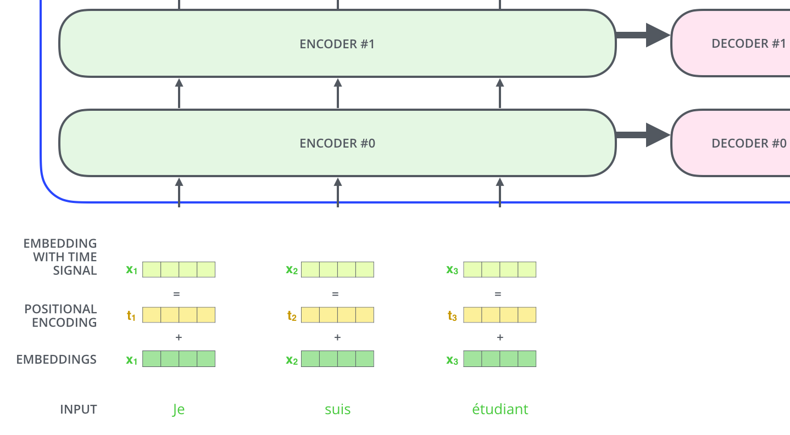
# 残差
*在$\mathrm{Attention\ Is\ All\ You\ Need}$中写过*
# Decoder具体运行
最后一个Encoder的输出被转换为一组注意力向量$K$和$V$.其输入到Cross Attention层(图1)中,帮助Decoder专注于输入序列的合适位置

Decoder层中,我们必须让其只能关注到输出序列中较早的位置(自注意力计算时,未来的位置设置为$-\inf$)
“Encoder-Decoder Attention”(或者叫Cross Attention) layer和多头注意力机制类似,只是他的Query来源于上一层,Key和Value来源于Encoder
# The Final Linear and Softmax Layer
Decoder输出一个浮点数向量到Linear Layer(一个简单的FFN),然后其输出一个$\mathrm{logits}$向量(大小是词表的长度),每个位置对应一个独特单词的分数.然后经过$\mathrm{softmax}$层将这些分数变为概率.最后,概率最高的位置被选中,对应的单词作为当前时间步的输出
# 训练模型
假设词表只有六个词“a”，“am”，“i”，“thanks”，“student”，以及“<eos>”（意为“句子结束”））
我们可以用一个该长度的向量,表示词汇表的每一个词.例如"am"表示为向量:`[0.0, 1.0, 0.0, 0.0, 0.0, 0.0]`(one-hot编码)
# 损失函数
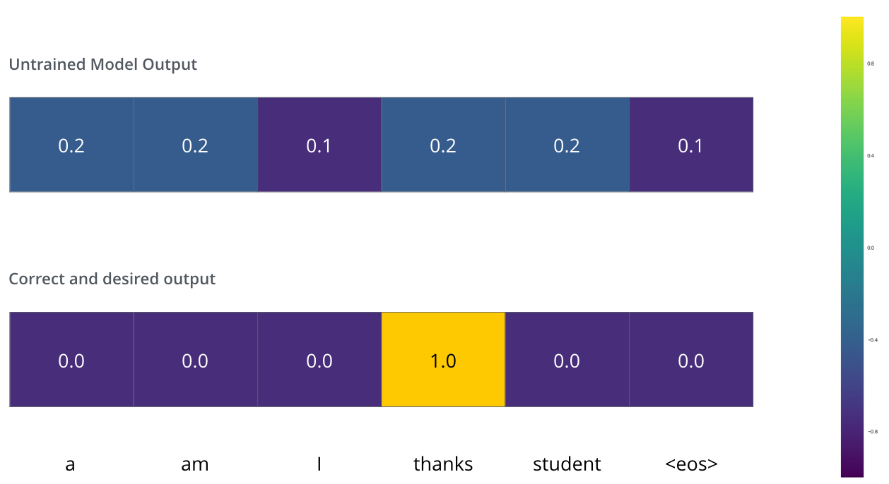
模型的参数是随机初始化的,我们使用反向传播进行训练
Trained Model Output应该是一个概率分布,我们同样把Correct and desired output看做概率分布.通过$D_{KL}$以及交叉熵来比较两个概率分布
如果对于一个句子,模型依次输出概率分布

训练过后,输出向量可能像这样:
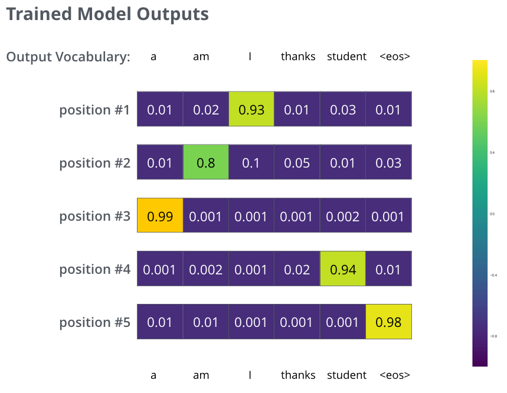

由于模型一次只会生成一个输出:
1. 一种方法是从概率分布中选择概率最高的词,并丢弃剩余词(Greedy Decoding)
2. 另一种是,例如对第一个位置:模型选择概率前两高的词,**分别假设**第一个位置为该词,然后计算第二个位置的词,算联合概率,最后保留联合概率最大的
$P(w_1,w_2)=P(w_1)P(w_2\mid w_1)$